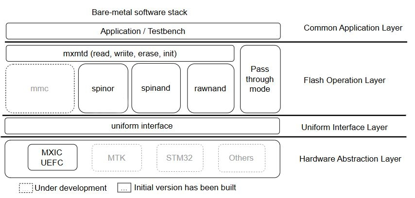

# Introduction
MxMTD is a Macronix memory technology driver that supports SPI NOR, SPI NAND,  Raw NAND and eMMC memories, offering essential operations such as read, write, and erase. The driver is is equipped with:
  - Flash operations for Read/Program/Erase.
  - Macronix S/W ECC BCH for RAWNAND/SPINAND
  - HAL
  - Test bench
## Architecture



This diagram illustrates a MxMTD software stack for operating Flash memory in an embedded system, organized into four main layers:
- __Common Application Layer:__ `[testbench/]`
  - Located at the top, containing Application / Testbench, which represents the end-user applications or tools used for testing Flash functionality.
  - This layer interacts directly with the Flash Operation Layer below to execute operations like read, write, erase, and initialization on the Flash memory.
- __Flash Operation Layer:__ `[mxmtd/]`
  - Allows the programmer easily to add new functionality by invoking the lower-level command functions in the desired sequence. 
  - This layer is the core for Flash memory operations, providing a set of abstract interfaces (e.g., mxmtd's read, write, erase, init).
  - The diagram lists several different Flash memory drivers or management modules, including:
    - mmc (eMMC driver)
    - spinor (SPI NOR Flash driver)
    - spinand (SPI NAND Flash driver)
    - rawinand (ONFI v1.0 standard)
    - Pass through mode (direct access mode, bypassing the RAW NAND, SPI NAND, SPI NOR, eMMC operations)
      - Is a method of bypassing standard flash memory operations to interact directly with its underlying hardware drivers.　

Located in the Flash Operation Layer, "Pass through mode" is an optional, non-standard operation path that exists alongside unified interfaces like mxmtd. This enables the Common Application Layer to implement scripts that directly operate the host controller through pass through mode.
- __Uniform Interface Layer:__ `[platform/]`
  - This layer provides a more unified and hardware-detail-decoupled interface for the Flash Operation Layer to use.
  - Its purpose is to simplify the development of the Flash Operation Layer by abstracting away the details of different hardware platforms.
  - Convey struct xfer_info_t, which includes all Flash operation-related information, to the HAL layer.
- __Hardware Abstraction Layer (HAL):__ `[platform/vendors/]`
  - It contains drivers and interfaces specific to different hardware platforms, such as UEFC , NXP, STM32, and Others, representing various microcontrollers or hardware platforms.
  - Operates controller register to transfer command, address, dummy and data. HAL is used to adapt the LLD to the target system.

### Tree view of driver structure
```bash
MxMTD
│
├── mxmtd/          # Core driver (Flash memories management)
│   ├── inc/        # Required header files and related configuration files for the mxmtd layer
│   ├── lib/        # Some APIs required to drive such as ECC, Crypto library, etc.
│   ├── rawnand/    # Raw Nand Flash API implementation
│   ├── spinand/    # SPI Nand Flash API implementation
│   ├── spinor/     # SPI Nor Flash API implementation
│   ├── mxmtd.c     # Initializing the Flash device, setting up the memory controller, probing the Flash, and handling resource cleanup.
|   ├── nand.c      # Including ECC handling, data calculating/correcting, and oob layout configuration. 
│
├── platform/       # Hardware adaptation
│   ├── inc/        # Required header files and related configuration files for the platform layer
│   ├── src/        # For handling platform-level data transfers and interfacing with the host controller.  
│   ├── vendors/    # Host controller implementation for each vendors.
│
├── testbench/      # Testing tools for verious flash memories.
├── main.c          # Main execution file (initialization, testing)
```
## Include path
- mxmtd/inc/
- platform/inc/
- testbench/inc/
- platform/vendors/xilinx/zynq7000/inc/
## Environment (Development Platform)
- Hardware: Macronix LiteBoard base on Xilinx Zynq FPGA
  - Host Controller: UEFC
  - Bitstream: xSPI / RawNAND
- Software
  - Vitis SDK
- Debugger
  - JTAG
### Configurations
- mxmtd
  - mxmtd/inc/mxmtd_config.h

| CONF_NAME                  | Description                                           | Dependent on                 |
| :------------------------- | :---------------------------------------------------- | :--------------------------- |
| CONF_PREOBE_RESET          | Send reset command at the beginning of probe function |                              |
| CONF_RAWNAND               | Enable Raw NAND                                       |                              |
| CONF_SPINAND               | Enable SPI NAND                                       |                              |
| CONF_SPINOR                | Enable SPI NOR                                        |                              |
| CONF_ERS_SIZE              | Set the erase size (4K, 32K or 64K)                   | CONF_SPINOR                  |
| CONF_SPINAND_ECC_TYPE      | Specified SPINAND ECC Type                            | CONF_SPINAND                 |
| CONF_SPINAND_ECC_STEP_SIZE | Specified SPINAND ECC Step Size                       | CONF_SPINAND                 |
| CONF_RAWNAND_ECC_TYPE      | Specified RAWNAND ECC Type                            | CONF_RAWNAND                 |
| CONF_RAWNAND_ECC_STEP_SIZE | Specified RAWNAND ECC Step Size                       | CONF_RAWNAND                 |

- platform
  - platform/inc/platform_conf.h
    -  Please refer to the Documentation for detailed instructions.

| CONF_NAME             | Description                   | Dependent on |
| :-------------------- | :---------------------------- | :----------- |
| CONF_HC_TYPE          | Specify Host Controller Type  |              |

  - platform/inc/platform_print.h
    -  Please refer to the Documentation for detailed instructions.

| CONF_NAME           | Description             | Dependent on |
| :------------------ | :---------------------- | :----------- |
| CONF_PR_LEVEL       | Specified Print Level   |              |

__Please refer to the relevant config header file for details.__

## License

This project is licensed under the Apache 2.0.
